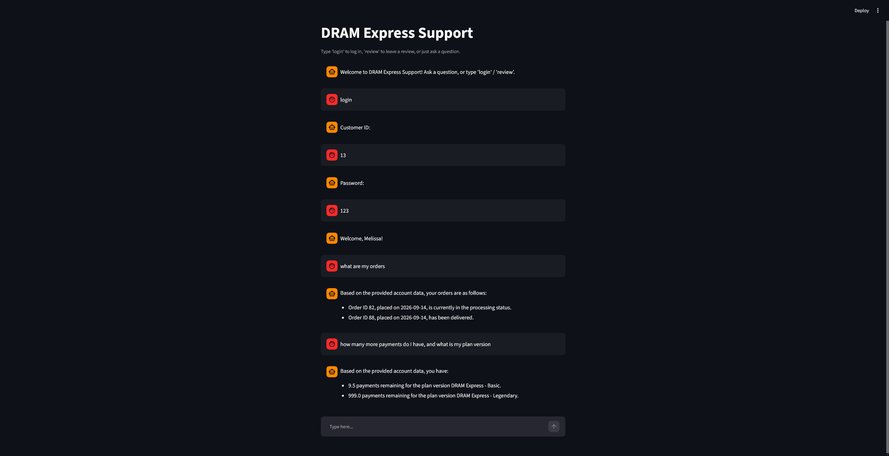

 
# DRAM Express Assistant

A fake customer support assistant for a fake company, built to
demonstrate a real skill: combining **RAG (retrieval-augmented
generation)** and **text-to-SQL** in one system, running entirely on
a locally-hosted open-source LLM.

**The company:** DRAM Express sells "Digital RAM" in three tiers
(Basic, Deluxe, Legendary), billed in absurd numbers of small
installments, with a return policy calibrated to close before it
opens. The comedy is the wrapper; the engineering underneath is real.

---

## What This Project Actually Does

A customer can ask this assistant natural-language questions, and it
answers using one of two sources depending on what's actually being
asked:

- **RAG** — for general policy questions ("what's your return
  policy," "do you ship to Florida"), it retrieves the relevant
  chunk from the company's own documentation and has the model write
  a natural answer from it.
- **Text-to-SQL** — for account-specific questions ("what's the
  status of my order," "how many payments do I have left"), it
  generates a SQL query against a real SQLite database and reports
  back the result.
- **Both at once** — a question that needs both ("can I get a
  refund on my order") pulls from each source and merges them into
  one answer.

A small LLM call classifies each incoming question to decide which
path (or both) it needs — this router is the piece that makes the
system feel like one coherent assistant instead of two disconnected
tools.

## The Moving Parts

| File | What it does |
|---|---|
| `seed_db.py` | Builds the fake SQLite database: customers, products, orders, order_items, reviews |
| `data/docs/*.md` | The knowledge base: return policy, shipping, warranty, installment terms, FAQ, product tiers, and a doc explaining what "Digital RAM" is |
| `build_index.py` | Chunks the docs and embeds them locally (sentence-transformers) into a persistent ChromaDB vector store |
| `auth.py` | Handles login and creates SQL views scoped to the logged-in customer, so no customer can ever see another's data |
| `router.py` | The core logic: classifies questions, retrieves context, generates SQL, and synthesizes final answers. Also runnable as a terminal chatbot. |
| `app.py` | The Streamlit chat UI wrapping everything above into a real, demoable app |

## Tech Stack

- **Model:** Llama 3.1 8B Instruct, quantized to Q4_K_M (~4.6GB), run
  locally via `llama-cpp-python` with full GPU offload (CUDA)
- **Embeddings:** `sentence-transformers` (`all-MiniLM-L6-v2`) —
  free, local, no API calls
- **Vector store:** ChromaDB (persistent, local)
- **Database:** SQLite
- **UI:** Streamlit

No paid API calls anywhere in this project — everything runs on
locally-hosted open-source models.

## How to Run It

```bash
# 1. Set up the environment (conda, py311, CUDA toolkit + CUDA-enabled
#    llama-cpp-python — see comments in each file for exact versions
#    this was built against)

# 2. Download the model (not included in this repo — see below)

# 3. Seed the fake database
python seed_db.py

# 4. Build the RAG index from the knowledge base docs
python build_index.py

# 5. Run it — either the terminal version:
python router.py

# ...or the full chat UI:
python -m streamlit run app.py
```

### Downloading the Model

This project uses **Meta-Llama-3.1-8B-Instruct**, quantized to Q4_K_M
(~4.6GB). It's not included in this repo (GitHub rejects files over
100MB, and model weights don't belong in version control regardless).

```bash
pip install huggingface-hub

hf download bartowski/Meta-Llama-3.1-8B-Instruct-GGUF \
  Meta-Llama-3.1-8B-Instruct-Q4_K_M.gguf --local-dir ./models
```

Place it at `models/Meta-Llama-3.1-8B-Instruct-Q4_K_M.gguf` relative
to the project root — that's the path `router.py` and `app.py`
expect. If you want a different quantization or model entirely,
update `MODEL_PATH` in `router.py` to match.

Login uses a plain numeric customer ID (1 through however many were
seeded) with password `123` for every account — this is a demo, not
a real auth system.

## What I Learned / What I'm Taking Away

**RAG and text-to-SQL solve genuinely different problems, and
routing between them is its own real engineering task.** It's not
enough to just "have an LLM with some data" — deciding *which* data
source even applies to a given question, and merging two sources
when a question needs both, was its own non-trivial piece of the
system.

**Retrieval quality is a tuning problem, not a one-shot setup.**
Chunk size, chunk overlap, and even where the overlap text starts
(word boundaries, not raw character counts) measurably changed
whether the right section of a document got retrieved. Testing
retrieval in complete isolation from generation — before ever
involving the LLM — made it possible to actually diagnose whether a
bad answer was a retrieval problem or a generation problem, instead
of guessing.

**Prompt instructions alone are not a security boundary.** Telling
the model "don't filter by customer_id, you don't know the real
value" reduced the problem but didn't eliminate it — the model kept
guessing anyway. The actual fix was structural: SQL views that never
exposed a `customer_id` column at all, so the mistake was
impossible, or failed loudly, rather than silently returning wrong
(or worse, another customer's) data. This was probably the single
most important lesson of the project: for anything security-relevant,
the LLM's behavior should be constrained by what it's structurally
capable of doing, not just by what it's told to do.

**Guardrails need to be scoped narrowly, or they misfire.** A
broadly-worded "refuse anything harmful" instruction ended up
blocking the assistant from relaying a customer's *own* review back
to them, just because the review contained profanity. The fix wasn't
removing the guardrail, it was being precise about what it applied
to (the customer's request) versus what it didn't (retrieved account
data being reported factually).

**Environment setup is its own skill, separate from the ML work.**
CUDA toolkit version mismatches, conda channel conflicts, PATH
ordering across shared department machines, and NFS-vs-local home
directory quirks ate up real time — and debugging them methodically
(checking `nvcc --version`, `nvidia-smi`, `which python`,
cross-referencing what a traceback actually said versus what I
assumed it said) was as much a transferable skill as anything in the
model code itself.

**Quantization is a real, usable trade-off, not just a checkbox.**
Running an 8B parameter model at Q4 quantization (roughly a third
the size of full precision) was more than sufficient for constrained
tasks like SQL generation and grounded answer synthesis — a good
reminder that matching model size/precision to the actual difficulty
of the task matters more than defaulting to the biggest available
model.